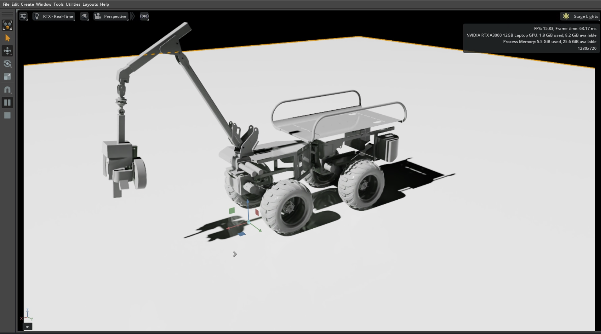
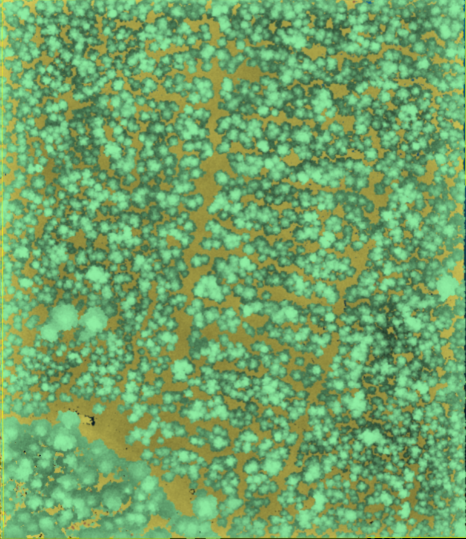
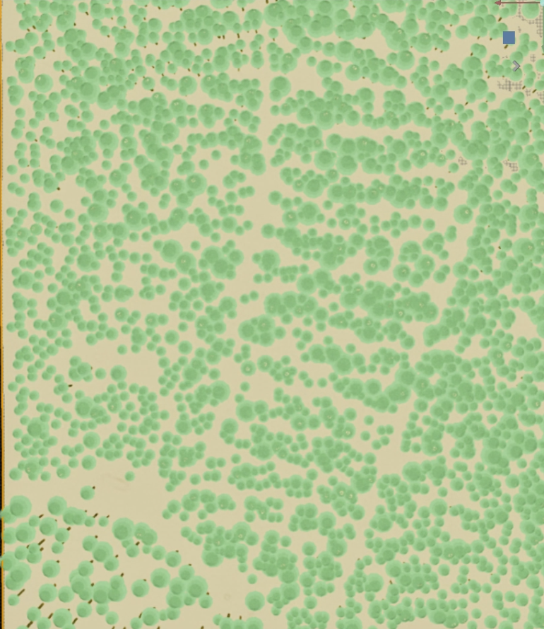
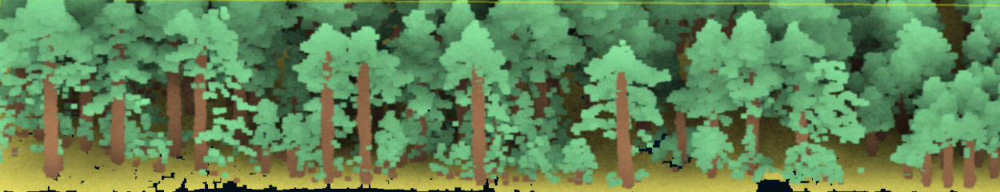
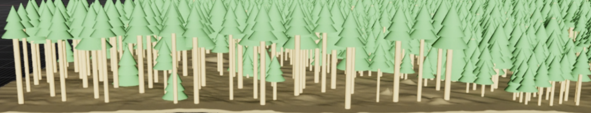

# IsaacForestSim

Turn segmented forest point clouds into a clean, navigable digital twin for Isaac Sim, with terrain, trunks, and more realistic pine canopy ready for playground experiments.



SAHA harvester concept for future forest playground tasks, where the digital twin can be used as the scene layer for navigation, interaction, and machine simulation.

## Digital Twin Preview

### PointCloud -> Isaac Physical Enviornment

<table>
  <tr>
    <td align="center" width="50%">
      
    </td>
    <td align="center" width="50%">
      
    </td>
  </tr>
  <tr>
    <td align="center">
      Raw segmented forest point cloud with ground, trunks, and canopy prepared as reconstruction input.
    </td>
    <td align="center">
      Generated forest digital twin loaded in Isaac Sim with terrain surface, tree trunks, and realistic pine canopy.
    </td>
  </tr>
  <tr>
    <td align="center" width="50%">
      
    </td>
    <td align="center" width="50%">
      
    </td>
  </tr>
  <tr>
    <td align="center">
      Side slice of the segmented point cloud, showing vertical structure around trunks and lower canopy.
    </td>
    <td align="center">
      Matching side slice of the generated Isaac Sim digital twin, showing how trunk shape and canopy volume are reconstructed in the scene.
    </td>
  </tr>
</table>

Together these views show the full transition from segmented forest point cloud input to an Isaac Sim digital twin, both from the top view and from the side slice through the trees.

## Generate Digital Twin

The main generator is [forest_env_demo.py](/home/prefor/IsaacForestSim/script/digitwin/forest_env_demo.py).

Input point clouds:

- `script/data/example_forest_pointcloud/porvoo-20250520-000013_ground_sec.ply`
- `script/data/example_forest_pointcloud/porvoo-20250520-000013_trunk_sec.ply`
- `script/data/example_forest_pointcloud/porvoo-20250520-000013_canopy_sec.ply`

Output bundle:

- `data/forest_twin/forest_demo.usda`
- `data/forest_twin/forest_demo_manifest.json`
- `data/forest_twin/forest_demo_cache.npz`

Run inside Isaac Sim container:

```bash
make run-forest-usda-from-pointcloud
```

Or run the script directly with the default repo paths:

```bash
python3 script/digitwin/forest_env_demo.py --output-dir data/forest_twin --add-canopy
```

The generator will use the more realistic pine canopy asset from
`/home/prefor/isaac-sim/plan/canopy_assets/pine_tree.usd` when it is available.
